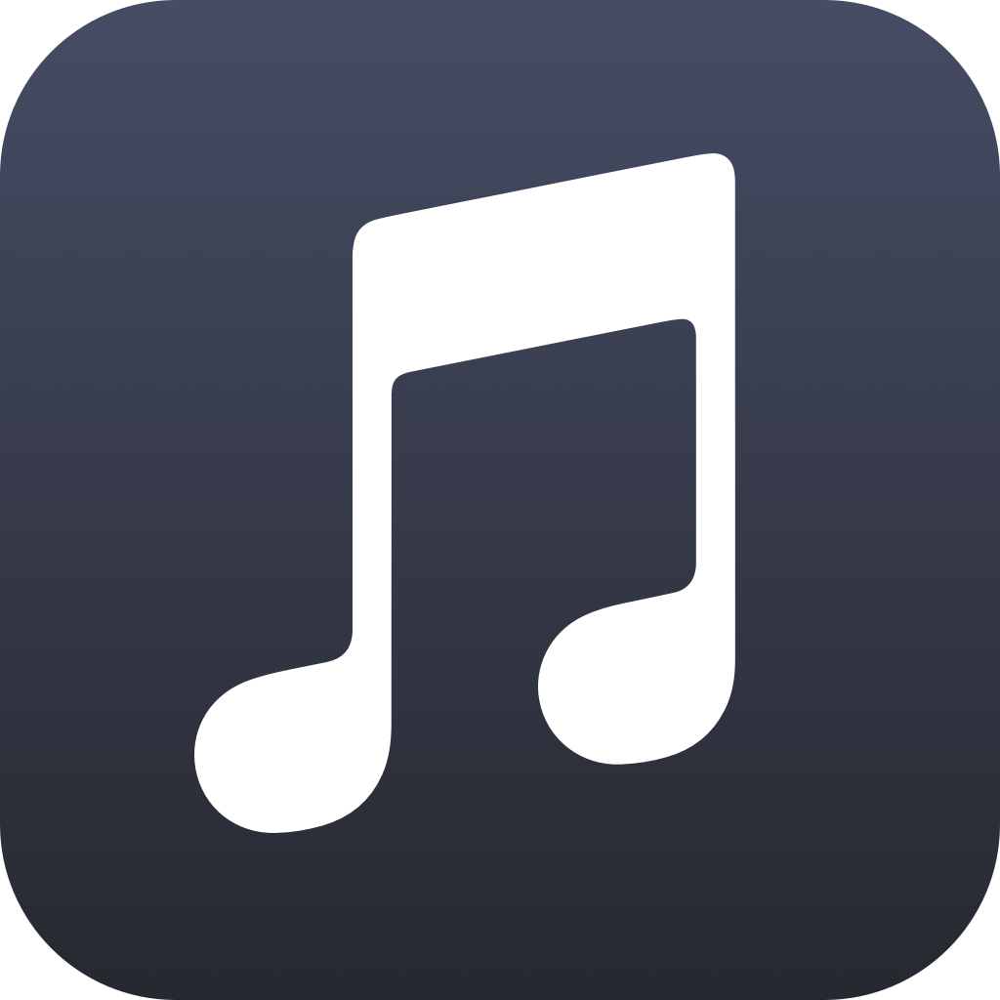

<!-- HEADER -->

<h1> MusicApp </h1>

[][Swift]
[][Swift]
[][iOS]

<!-- BODY -->

## Frameworks/External dependencies
- Foundation
- SwiftUI
- Combine
- Asynchronous (async) Functions

## Description
Apple Music app replica built with SwiftUI, Combine and the MVVM design pattern using Apple iTunes API.
Build on an actual device while having an active Apple Music subscription to experience all the app's features.

The app is still work in progress.

## Preview

<!-- FOOTER -->
<!-- Permanent links -->
[Swift]: https://www.swift.org
[iOS]: https://developer.apple.com/ios/

